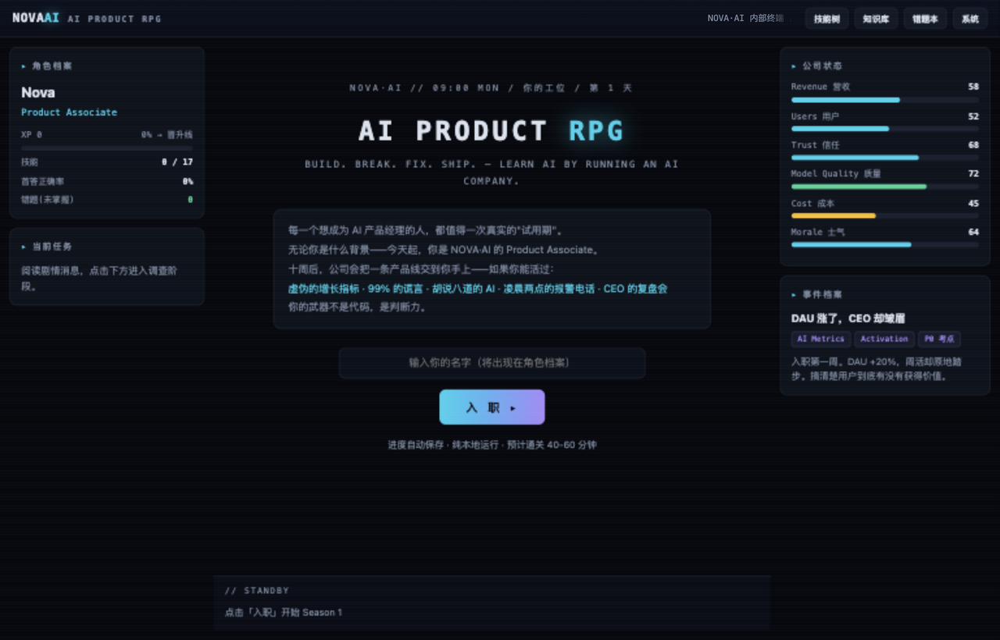
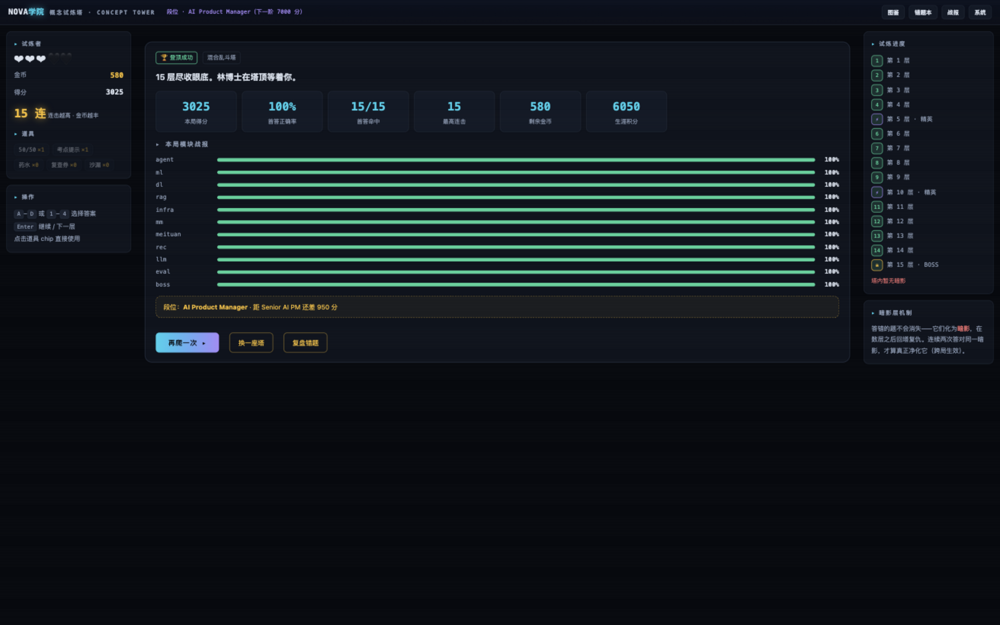
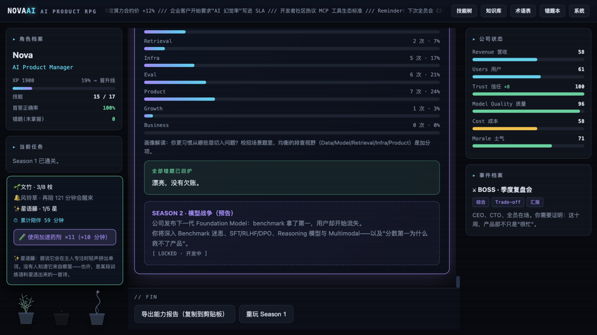
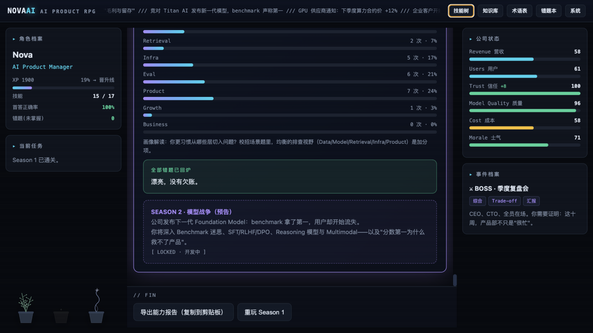
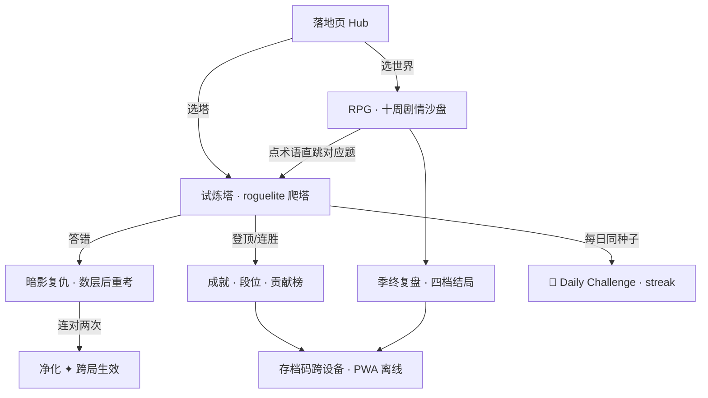

# AI 产品经理笔试题库游戏 · Nova学院

> **两款可以直接玩的网页游戏，把 AI 产品 / 运营 / 增长方向的求职笔试知识变成游戏——校招、社招、转行都适用。**
> **耍中找学，学中来耍。耍学结合，以耍为主。Play to learn, learn to play. Learn through play, with play first.**

[](https://ink7011.github.io/ai-pm-exam-games/)
[](tower/js/deck-data.js)
[](tools/smoke.js)
[](LICENSE)

**如果这个仓库帮到了你，点一个 ⭐ 让更多准备 AI 产品岗的同学看到它。**

---

## 📸 先看图 / Screenshots

| 门户 Hub | RPG · 开局 | RPG · 剧情决策 | RPG · 季终复盘 |
|---|---|---|---|
|  |  |  |  |
| **塔 · 概念遭遇** | **塔 · 每题解析** | **RPG · 伴学植物** | **RPG · 结局墙** |
|  |  |  |  |

---

## 🎯 产品定位

**Nova 学院：给 AI 产品 / 运营 / 增长求职者的「耍中学」备考游乐场。**

- **判断力 × 记忆力双修**：RPG 用剧情教你判断，塔用爬塔帮你记忆——AI 岗笔试恰恰同时考这两种能力；
- **谁该来**：准备 AI 产品/运营/增长岗的校招与社招同学、转行者，以及单纯「想先了解这个行业」的人；
- **差异化**：市面题库是列表，我们是游戏。列表让你还债，游戏让你复仇（字面意义，见「暗影复仇」）。

## 😫 用户问题

| # | 用户问题 | 我们的解法 |
|---|---|---|
| 1 | 刷题无聊，错题本没人回头看 | 错题化为**暗影**回塔复仇，连对两次净化——间隔重复穿上叙事的皮 |
| 2 | 概念背了就忘，复习没有机制 | 跨局生效的暗影系统 + 每日挑战（同种子全服同塔）+ streak |
| 3 | 情境判断题没有训练工具 | RPG 十周剧情沙盘：每个决策写进指标，季终复盘会见真章 |
| 4 | 蒙对了也不知道为什么对 | **每题四选项逐一判词**——错误项也是教学素材 |

## 🎮 核心玩法

### 🧭 判断力 · AI PRODUCT RPG（`rpg/`）

入职 NOVA·AI，十周历劫：虚荣指标、99% 的谎言、胡说八道的 AI、凌晨两点的 P0——最终在 CEO 复盘会上证明自己。**≈50 分钟通关，进度本地保存。**

- 👑 四档季终结局：天选之人 / 传奇产品人 / 稳健派 / 潜力股
- 📉 不进则退：每周指标自然下滑，躺赢不存在
- 📖 94 词术语悬浮词典 · 一键跳「术语深化塔」
- 🌱 三盆伴学植物 · 🧪 零失误药剂 · ☕ 3 小时温柔休息提醒
- 💾 存档码跨设备 · 开场 / 每章 / 终章过场动画

### 🗼 记忆力 · 概念试炼塔（`tower/`）

335 题 roguelite 爬塔（245 免费基础 + 6 座进阶实战塔 90 题随秋招上新）：3 颗心、限时精英层、BOSS 层、道具商店。**每题四选项逐一判词。≈10 分钟/局。**

- 👁 **暗影复仇**：错题 3 层后回来重考，连对两次净化（跨局生效）
- 🎴 **每日挑战**：全世界今天爬同一座塔（日期种子 · 1 心 10 层 · 连胜 streak）
- 🏆 **跨游戏成就墙**（18 枚，两游戏互通，存档码打包）
- 🗼 17 座塔（11 基础 + 6 大厂风格实战）· `?mod=` 直达 · 弱点侦察 · 段位系统
- 🎵 试炼 BGM（WebAudio 实时合成 · 可关）· 📖 年鉴风反馈墙 · 🎋 六爻求签
- 覆盖 16 模块：ML · LLM 训练/推理 · RAG · Agent · 评估 · Infra · 产品商业 · 业务场景

**组合循环**：在 RPG 里理解 → 去塔里记牢 → 暗影替你对抗遗忘曲线 → 回 RPG 用对。

## 🧭 产品流程



新用户 3 分钟上手（A→C→答题），10 分钟一局形成完整体验闭环；50 分钟 RPG 通关解锁跨游戏资产（植物/成就），留存钩子全部跨局跨作品生效。

## 🧠 为什么这么设计

每一条机制都对应学习科学或行为设计，完整取舍见 **[docs/DESIGN-DECISIONS.md](docs/DESIGN-DECISIONS.md)**（10 条，含被否掉的方案）：

- **暗影复仇而不是错题本**——列表=还债，复仇=动机反转；连对两次=巩固窗口；
- **六爻求签不是随机签到**——同人同日同时辰永远同签（确定性可解释），1080 签池旋转构造，数学保证任意 90 天窗口不重签；
- **存档码而不是账号系统**——能不注册就不注册，用户拥有自己的数据；
- **零依赖而不是框架全家桶**——可分发、可审计、断网可玩（备考场景刚需）。

## 📋 迭代记录

**v0.1 双世界 MVP** → **v0.2 记忆系统成型**（暗影 2.0 · 每日挑战 · 成就墙）→ **v0.3 仪式感与留存**（六爻求签 · 伴学植物 · 年鉴墙 · 内测反馈驱动难度重排）→ **v0.4 双端与进阶内容**（小程序同步 · 四选项判词 · 6 座进阶实战塔）。

完整版本史：**[docs/CHANGELOG.md](docs/CHANGELOG.md)**

---

## 🌌 两个世界 / The Two Worlds

🗼 **概念试炼塔 = 大世界观。** NOVA 学院矗立在「遗忘之潮」边缘——被忘记的知识沉入塔底，化为**暗影**。答错喂养暗影，连对两次将其净化为星光。

🔗 **两界之桥。** 术语表是桥，存档码是界间护照，错题本与暗影共享同一法则。

🧭 **AI PRODUCT RPG = 平行世界。** 学院的实战沙盘 S1：一家叫 NOVA·AI 的公司，十周试用期，真实的指标与后果——直到季终复盘会 **THE REVIEW**。

*The Tower is the greater world where shadows enforce spaced repetition; the RPG is its parallel sandbox where you live with the consequences. Two games, one lore.*

完整设定 · 编年史 · 五段过场动画正典 → **[docs/WORLDVIEW.md](docs/WORLDVIEW.md)**

---

## 🏗 技术架构

- **零依赖**：纯原生 HTML/CSS/JS，无框架、无构建链、无后端；动画手写，BGM 用 WebAudio 实时合成
- **双端同核**：Web（`tower/js` · `rpg/js`）与微信小程序（`miniprogram/`）共享同一份题库与核心逻辑，兑换码互通
- **离线 PWA**：Service Worker 版本化缓存，断网可玩
- **零后端解锁**：进阶题库以密文随前端分发，兑换码哈希校验（FNV-1a）与解密（SHA-256 链式密钥流）全部本地完成（`shared/paid-crypto.js`）
- **回归安全网**：`node tools/smoke.js` —— 161 条断言（题库完整性 / 双端一致性 / 安全边界 / 版本卫生）

## 🚀 运行 / Run

**在线玩**：https://ink7011.github.io/ai-pm-exam-games/ · **本地**：`python3 -m http.server 8000` · **测试**：`node tools/smoke.js` · **微信小程序**：`miniprogram/`（已同步 245 题基础库 · 解析 · 大厂分区 · 兑换码与 Web 互通，导入微信开发者工具即可预览，发布指南见 `docs/WECHAT.md`）

## 🤖 附赠：终端刷题 Agent Skill

```bash
cp -r agent-skill ~/.claude/skills/ai-pm-quiz    # Claude Code；ZCode 用 .zcode/skills/
```

装好后对 Agent 说「来一道 AI 产品题」——同源题库，错题间隔重考。

## 🗺 路线图 / Roadmap

- [ ] 英文版 / English version
- [ ] RPG Season 2：模型战争（Benchmark 迷思 / SFT / RLHF / Reasoning）
- [ ] 微信小程序发布 / WeChat Mini Program release
- [ ] 更多题库接入（欢迎 PR 你的题库）

**更新题库**：`python3 tools/build-deck.py 你的题库.md -o tower/js/deck-data.js` · [MIT](LICENSE)

**迭代工作流**：本仓库用 Builder / Reviewer 分离制开发（grill → spec → tickets → implement → code-review），见 **[docs/WORKFLOW.md](docs/WORKFLOW.md)**。
