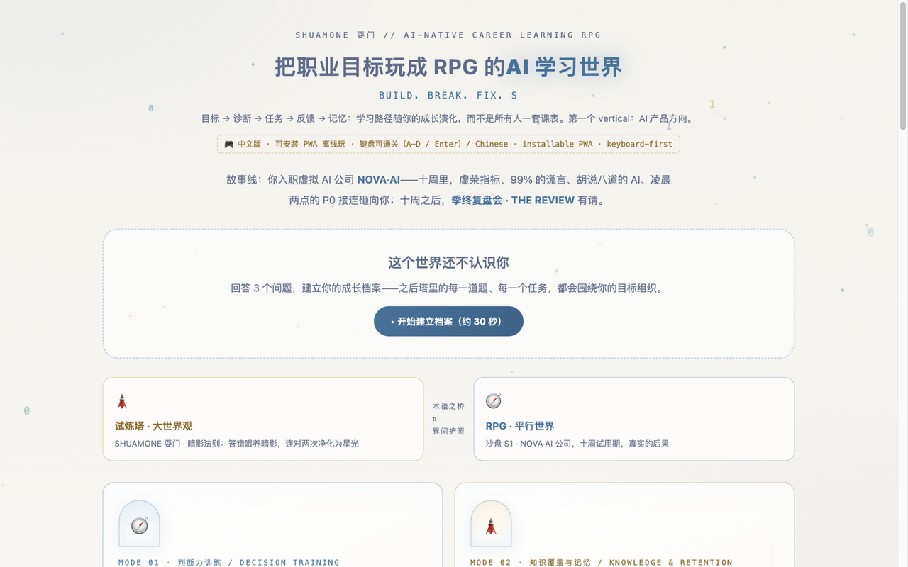
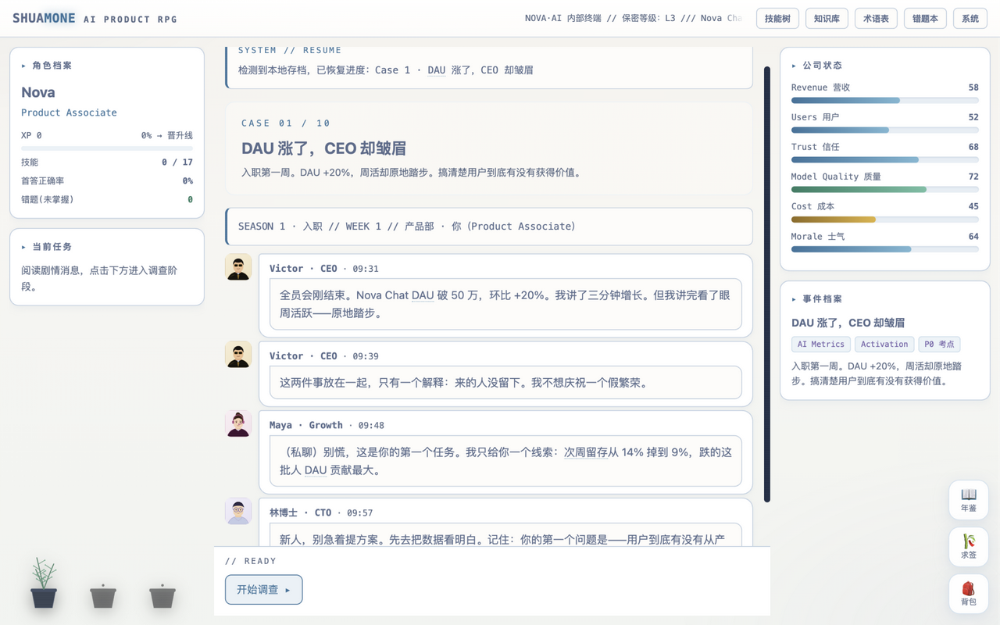
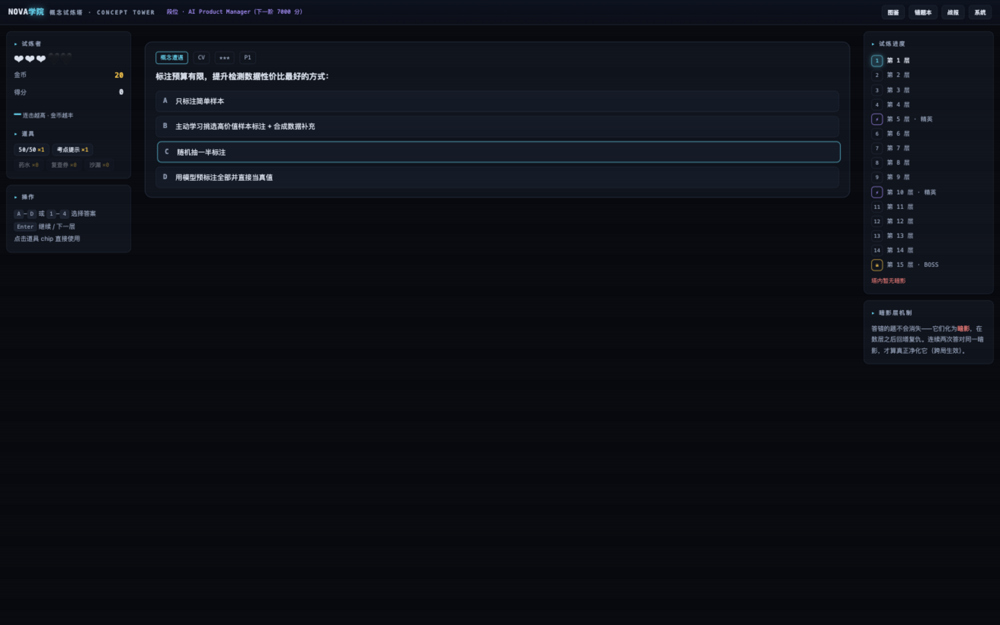
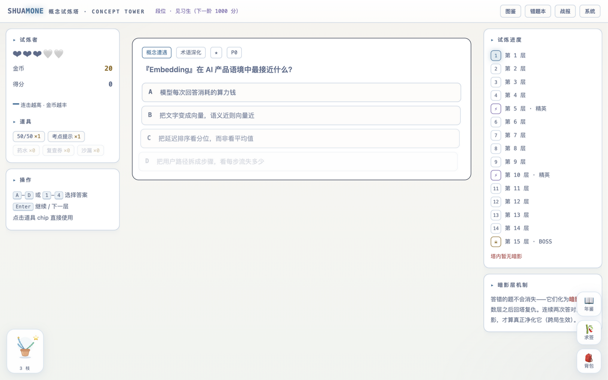

# SHUAMONE 耍门 · AI-native Career Learning RPG

### Start with AI Product Management.

> **A career learning RPG that evolves with your goals, skills, and journey.**
> 把求职备考做成一个随你成长而演化的学习世界——当前第一个 vertical：AI 产品方向。
> 耍中找学，学中来耍。Play to learn, learn to play.

[](https://ink7011.github.io/ai-pm-exam-games/)
[](tower/js/deck-data.js)
[](docs/CHANGELOG.md)
[](tools/smoke.js)
[](LICENSE)

**如果这个仓库帮到了你，点一个 ⭐ 让更多准备 AI 产品岗的同学看到它。**

---

## 1. What is this?

An **AI-native Career Learning RPG**. 当前处于 early-stage prototype（V0.5）。

传统学习平台围绕「科目」组织内容；这个项目探索另一种模型：

> **Organize learning around the learner.**

用户不是来"刷完课程"的，而是在一个持续成长的学习世界里，围绕自己的职业目标完成任务、做决策、获得反馈——学习路径随能力与阶段变化。

## 2. The Idea（本版本要验证的假设）

不是把产品做成巨大的 lifelong-learning platform，而是先验证一件事：

> **如果学习内容与用户自己的职业目标、能力和成长轨迹绑定，用户是否会比单纯刷题更愿意持续回来学习？**

三个具体假设：用户愿意告诉产品"我想成为谁"；用户感到"这个任务确实是针对我的"；用户因为"我的 Career Journey 在继续"而回来。

AI-native ≠ AI-generated everything. V0.5 的个性化全部由**规则引擎**驱动（无 LLM、无 API 调用）——先证明 Personalization → engagement，再谈模型。

## 3. Current Vertical

**AI Product Management**（AI PM / 运营 / 增长方向的求职者与想入行的人）。其他职业方向是未来的事，不是现在。

## 4. How It Works

```
Goal → Diagnose → Quest → Decision → Feedback → Memory → Level Up → New Quest
```

- **Goal**：3 个问题的 onboarding 建立你的 Career Profile（目标 / 阶段 / 想加强的方向）
- **Diagnose**：Skill Map——7 项技能由你在塔与 RPG 里的**真实作答**计算，不是自评
- **Quest**：Today's Quest 由你的最弱技能规则化推荐，并告诉你 *why this, why now*
- **Memory**：暗影复仇——错题化为暗影回塔，连对两次净化（间隔重复）
- **Level Up**：技能值、等级、Career Journey 时间轴全部由真实事件推导

## 5. Current Experience

| 模块 | 说明 |
|---|---|
| 🧭 **AI PRODUCT RPG** | 十周试用期剧情沙盘（10 Case · 四档结局 · 94 词词典）——练判断力 |
| 🗼 **概念试炼塔** | 335 题 roguelite 爬塔（245 免费 + 6 座进阶实战塔）——练记忆力，每题四选项逐一判词 |
| 👁 **Shadow Revenge** | 错题事件化：*"A Shadow has appeared — RAG is becoming your weak point."* |
| 🎴 **Adaptive Daily** | 今日挑战不再纯随机：优先你的成长区技能与本周错题（含推荐理由） |
| ◈ **Skill Map** | 强项 / 成长区 / 下一推荐任务——"我正在成为怎样的 AI Product person" |
| ⟡ **Career Journey** | 时间轴：Started → 技能觉醒 → Quest → RPG 通关 → AI PM Ready |
| 📖 年鉴墙 · 🎋 六爻求签 · 🌱 伴学植物 | 仪式感与留存层（详见 [docs/DESIGN-DECISIONS.md](docs/DESIGN-DECISIONS.md)） |

## 6. Product Philosophy

- **We are exploring whether** organizing learning around the learner improves engagement——不是"我们重新发明了教育"。
- **Early-stage prototype**：没有成千上万的 learners，没有已验证的留存数据。假设尚未被证明。
- 零后端、零依赖（纯原生 JS）、数据只在用户浏览器里；付费内容（6 座进阶塔）以密文分发 + 本地哈希校验解锁，基础内容永远免费。
- 小程序双端版开发完成后**主动砍掉**（各厂测评在电脑端），聚焦 Web——详见 [docs/CHANGELOG.md](docs/CHANGELOG.md)。

## 7. 迭代与设计

- **v0.1** 双世界 MVP → **v0.2** 记忆系统（暗影/每日/成就）→ **v0.3** 仪式与留存（六爻/植物/年鉴）→ **v0.4** 进阶内容与聚焦 → **v0.5** Personal Career Layer（当前）
- 完整版本史：[docs/CHANGELOG.md](docs/CHANGELOG.md) · 十条设计取舍（含被否掉的方案）：[docs/DESIGN-DECISIONS.md](docs/DESIGN-DECISIONS.md)
- 世界观正典：[docs/WORLDVIEW.md](docs/WORLDVIEW.md)

## 8. Run

**在线玩**：https://ink7011.github.io/ai-pm-exam-games/ · **本地**：`python3 -m http.server 8000` · **测试**：`node tools/smoke.js`

## 📸 Screenshots

| 门户 + Career 面板 | RPG · 剧情决策 | 塔 · 概念遭遇 | 塔 · 每题解析 |
|---|---|---|---|
|  |  |  |  |

## 🤖 附赠：终端刷题 Agent Skill

```bash
cp -r agent-skill ~/.claude/skills/ai-pm-quiz    # Claude Code；ZCode 用 .zcode/skills/
```

## 🗺 Roadmap

- [ ] 验证 V0.5 三假设（真实留存数据）
- [ ] RPG Season 2：模型战争（Benchmark 迷思 / SFT / RLHF / Reasoning）
- [ ] Learner Model 接入 LLM（当规则引擎证明假设之后）
- [ ] 更多题库接入（欢迎 PR 你的题库）

**更新题库**：`python3 tools/build-deck.py 你的题库.md -o tower/js/deck-data.js` · [MIT](LICENSE)

**迭代工作流**：Builder / Reviewer 分离制（grill → spec → tickets → implement → code-review），见 [docs/WORKFLOW.md](docs/WORKFLOW.md)。
